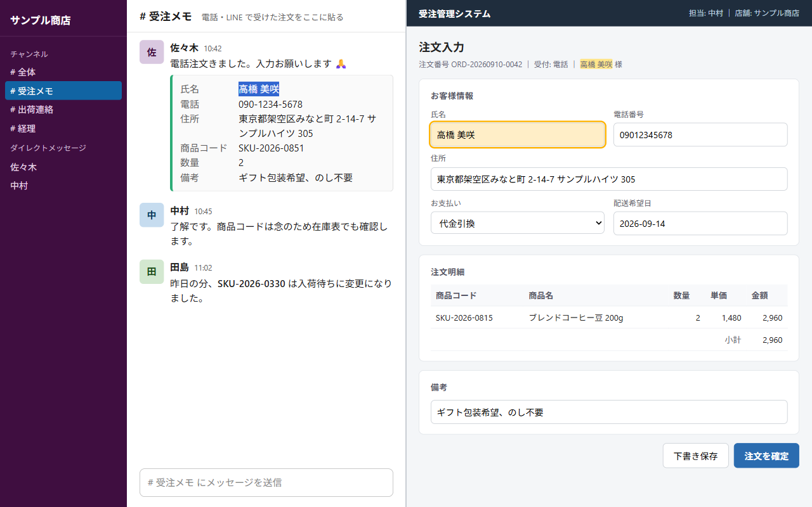

# クロスウィンドウ・ハイライト（Cross-Window Highlight）



ON の間、文字を選択すると、他のタブ／ウィンドウの一致箇所を自動でハイライトする Chrome 拡張です。
請求書と伝票、原稿と校正紙のように、2画面で照合・突合をする作業のために作りました。

- 全角／半角、大文字／小文字、ハイフン・空白の違いは無視して一致させます（`ＩＮＶ－0042` と `inv-0042` は同じ扱い）。**完全一致と表記違いの一致は色で区別**します（[一致の判定](#一致の判定何を無視して一致させているか)）
- 一致が 0 件のとき、「一致なし」と「確認できなかった」を分けて表示します
- `input` / `textarea` の中身は枠で示します
- リッチテキストエディタ（contenteditable）の中は書き換えません。入力中は再ハイライトを保留します
- データは一切収集しません。選択文字列は端末内のタブ間でしか受け渡されません（[プライバシーポリシー](https://km-tools.github.io/cross-window-highlight/privacy.html)）

## インストール

### Chrome ウェブストアから

審査中です。公開後にここへストアのリンクを入れます。
<!-- 公開後: [Chrome ウェブストアで入手](https://chromewebstore.google.com/detail/<拡張ID>) -->

### 開発者向け（パッケージ化されていない拡張機能として読み込む）

1. このリポジトリを clone する（`git clone https://github.com/km-tools/cross-window-highlight.git`）
2. Chrome で `chrome://extensions` を開く
3. 右上の「デベロッパーモード」を ON にする
4. 「パッケージ化されていない拡張機能を読み込む」で `src/` フォルダを選ぶ

ソースを変更したら、`chrome://extensions` で拡張のリロードボタンを押してください。

## 使い方

1. ツールバーのアイコンをクリックし、ポップアップのスイッチを ON にする（バッジが `ON` になります）。アイコンのクリックだけでは切り替わりません
2. どこかのページで文字を選択する（2文字以上）
3. 他のタブ／ウィンドウの一致箇所が黄色くハイライトされる
4. 選択を解除すると、少し待ってからハイライトも消える

ポップアップには「いまハイライト中」の文字列と、ショートカットの設定が表示されます。

### ショートカット

| 操作 | キー |
|---|---|
| ON / OFF | `Ctrl+Shift+H`（Mac: `Cmd+Shift+H`） |
| そのページのハイライトだけ消す | `Esc` |

ショートカットは `chrome://extensions/shortcuts` で変更できます（ポップアップにもリンクがあります）。

### 動かないページ

`chrome://` などブラウザ内部のページ、Chrome ウェブストア、拡張機能のページではハイライトしません。

## 一致の判定（何を無視して一致させているか）

このツールは「光った＝転記が正しい」を保証しません。表記の違いを無視して一致させる仕組みなので、**完全一致**と**表記違いの一致**を色で分けています。

| 見た目 | 意味 |
|---|---|
| 黄色 | **完全一致**。選択した文字列と、一致箇所の文字列が1文字残らず同じ |
| 薄い橙 + 点線の下線 | **表記違いの一致**。下の「無視する違い」を除いて同じ。マウスを乗せると説明が出る |
| 入力欄の実線の枠 / 破線の枠 | 入力欄の中身が完全一致 / 表記違いで一致 |

ポップアップの「いまハイライト中」に、他タブ全体の内訳（例：完全 3 / 表記違い 1）を出します。

### 無視する違い（正規化）

一致を探すとき、選択文字列と各ページの文字列の両方に次の処理をしてから比べます。

1. **次の文字を取り除く**
   - 空白類：半角スペース、タブ、改行、全角スペース（U+3000）
   - ハイフン類：`-`（U+002D）、`‐`（U+2010）、`‑`（U+2011）、`‒`（U+2012）、`–`（U+2013）、`—`（U+2014）、`―`（U+2015）、`−`（U+2212 マイナス）、`－`（U+FF0D 全角ハイフン）
2. **全角の英数字・記号（U+FF01〜U+FF5E）を半角にする**：`ＡＢＣ１２３／（）：＃` → `ABC123/():#`
3. **大文字を小文字にする**：`INV` と `inv` は同じ扱い

つまり `INV-2026-0042`、`inv 2026 0042`、`ＩＮＶ－２０２６－００４２` はすべて一致します。

### 無視しない違い

- 長音符 `ー`、中黒 `・`、波ダッシュ `〜`（U+301C）、アンダースコア `_`、ピリオド `.`、スラッシュ `/`
- ひらがな / カタカナ、半角カタカナ（`ｱｲｳ` は `アイウ` と一致しません）
- 数字の `0` と英字の `O`、`1` と `l` のような字形の似た文字

### 厳密比較モード（Pro）

Pro 設定の「厳密比較」を ON にすると、上の正規化を一切行わず、選択した文字列そのもの（大文字小文字・空白・ハイフンを含めて完全に同じもの）だけを探します。無料版は正規化ありの動作のみです。

## 「一致なし」と「確認できない」の区別

他のタブに1件も一致がないとき、それが本当に「一致なし」なのか、そもそも「確認できなかった」のかを分けて表示します。

| 状態 | バッジ（Pro の件数表示 ON のとき） | ポップアップ |
|---|---|---|
| 一致あり | 件数（表記違いがあれば `完全+表記違い`） | 内訳 |
| 確認できたタブで一致 0 件 | 赤の `0` | 「他のタブに一致はありません」 |
| 確認できるタブが1つもない | 灰色の `?` | 「確認できるタブがありません」 |
| 一部のタブが確認できず、残りで 0 件 | 赤の `0` | 上に加えて「一部のタブは確認できませんでした（n件）」 |

「確認できなかったタブ」は、ポップアップで一覧（タイトルと理由のみ。URL は出しません）を開けます。理由は次のとおりです。

- 拡張が動作しないページ（`chrome://` の設定画面、Chrome ウェブストア、他の拡張のページなど）
- 本文を読めないページ（PDF ビューアなど、スクリプトを入れられないページ）
- 応答がありませんでした（4秒以内に返事がなかったタブ）
- 除外ドメイン（Pro 設定で除外したページ）
- 休止中のタブ、入力中のため保留

空のタブ・新しいタブ・この拡張自身の画面は、本文がないので集計から外しています。

## 無料版と Pro 版

| | 無料 | Pro（準備中） |
|---|---|---|
| タブ／ウィンドウ間のハイライト | ○ | ○ |
| 全角／半角・大文字／小文字の正規化 | ○ | ○ |
| ショートカットで ON / OFF | ○ | ○ |
| 完全一致 / 表記違い一致の色分け | ○ | ○ |
| 「一致なし」と「確認できない」の区別 | ○ | ○ |
| ハイライト色のカスタム（完全一致・表記違い・入力欄） | | ○ |
| 厳密比較モード（正規化しない） | | ○ |
| 最小文字数の変更（1〜10） | | ○ |
| 除外ドメイン | | ○ |
| ヒット件数のバッジ表示（完全+表記違い / 0 / ?） | | ○ |
| 複数キーワードの同時ハイライト | | ○ |
| iframe 内のハイライト | | ○ |

Pro 版はライセンスキーで解放します。ライセンスキーの検証以外にネットワーク通信は行いません。
Pro の設定は `chrome.storage.sync` に保存されるので、同じ Google アカウントの Chrome 間で同期されます。ライセンスは端末ごとです。

## ライセンス（Polar.sh）

販売と検証は [Polar.sh](https://polar.sh) を使います。席数（端末数）は Polar 側の「ライセンスキーのアクティベーション上限」で表現します。
検証は `src/license.js` の中だけで行い、プロバイダは差し替え可能な構造です（切り替え先の候補は Gumroad）。

### 使う API（customer-portal 系、認証不要）

出典: `https://polar.sh/docs/openapi.json`（version 2026-04、2026-09-07 確認）。本番 `https://api.polar.sh`、sandbox `https://sandbox-api.polar.sh`。

| 目的 | エンドポイント | リクエスト | 成功 | 失敗 |
|---|---|---|---|---|
| 端末を登録 | `POST /v1/customer-portal/license-keys/activate` | `{ key, organization_id, label, meta? }` | 200 `{ id（activation_id）, license_key: { status, expires_at, limit_activations, … } }` | 403 `NotPermitted`（上限到達、またはアクティベーション未設定のキー）／404 `ResourceNotFound` |
| 定期確認 | `POST /v1/customer-portal/license-keys/validate` | `{ key, organization_id, activation_id? }` | 200 `{ status: granted \| revoked \| disabled, expires_at, limit_activations, activation?, … }` | 404 `ResourceNotFound`（キーまたは activation_id が不明） |
| 端末を解除 | `POST /v1/customer-portal/license-keys/deactivate` | `{ key, organization_id, activation_id }` | 204 | 404 `ResourceNotFound` |

送信するのは上の項目だけです。`meta` は `{ client: "chrome-extension" }` 固定、`label` は日付と鍵ハッシュ先頭6文字です。選択文字列や URL は送りません。

### 拡張側の動き

1. ポップアップでキーを入力 → `activate`。成功したら `activation_id` を端末内（`chrome.storage.local` の `cwh_license`）に保存
2. `activate` が 403 のときは `validate` を試し、`limit_activations` が `null`（上限設定なしのキー）なら validate 結果で認証。数値なら「端末数の上限」エラー
3. 7日ごとに `validate` で再確認。サーバーに届かないときは前回結果を維持
4. 「この端末の認証を解除」で `deactivate` を呼び、端末内の情報を消す
5. `status` が `granted` 以外、または `expires_at` を過ぎたキーは無効扱い。無効になった瞬間に Pro 設定はデフォルト値へ戻る

### 設定（公開前に必要）

`src/license.js` の `CWH_LICENSE_CONFIG` に以下を入れる:

- `organizationId`: Polar の Organization ID（Settings > General）。**本番と sandbox で別**
- `purchaseUrl`: Polar のチェックアウトリンク
- `apiBase`: 本番は `https://api.polar.sh` のまま

Polar 側では、Product の Benefit に「License Keys」を追加し、Activation limit を席数に設定します。

### sandbox / モックで試す

`chrome.storage.local` の `cwh_dev` を入れると接続先を上書きできます（拡張の Service Worker のコンソールで）:

```js
chrome.storage.local.set({ cwh_dev: { apiBase: "https://sandbox-api.polar.sh", organizationId: "<sandbox の org id>" } })
```

消すときは `chrome.storage.local.remove("cwh_dev")`。
`node tools/e2e-pro.js` は Polar の仕様どおりに応答するモックサーバーを立てて、上の 1〜5 と Pro 機能、完全一致/表記違いの色分け、厳密比較、判定不能タブの扱い、「ライセンス API 以外の通信がない」ことを確認します（60 項目）。

## 構成

```
src/            拡張本体（ストアに出すのはこのフォルダ）
  manifest.json
  background.js   Service Worker。タブ間の中継と状態管理
  content.js      各ページで動くハイライト本体
  settings.js     Pro 設定のデフォルト値と読み書き（3画面で共通）
  license.js      ライセンス検証（外部通信はここだけ）
  popup/          設定ポップアップ
  _locales/       日本語 / 英語
  icons/          アイコン（icon.svg が元絵）
tools/          開発用スクリプト（npm 依存はここだけ）
docs/           プライバシーポリシーなど（GitHub Pages 用）
store/          ストア申請の素材（説明文、権限の説明、スクリーンショットと撮影用ページ）
package.sh      ストア提出用 ZIP を dist/ に作る
```

## 開発

```bash
cd tools && npm install
```

| コマンド | 内容 |
|---|---|
| `node tools/build-icons.js` | `src/icons/icon.svg` から PNG を再生成 |
| `node tools/e2e.js --lang=ja` | 実機 Chrome で動作確認（日本語） |
| `node tools/e2e.js --lang=en` | 同上（英語） |
| `node tools/e2e-pro.js` | Pro 機能とライセンス（モック Polar サーバーで確認） |
| `node tools/shoot-store.js` | ストア用スクリーンショット 3 枚を実機で撮り直す。行数の多い一覧での走査時間も表示 |
| `./package.sh` | `dist/cross-window-highlight-<version>.zip` を作る（src/ の中身だけ、manifest がルート） |
| `./package.sh --verify` | ZIP を展開して e2e を全部通す（ストア提出前に実行） |

e2e は puppeteer-core でインストール済みの Chrome を起動し、2タブ間のハイライト、contenteditable の保護、ポップアップの ON / OFF、多言語表示を確認します。Chrome 137 以降は `--load-extension` が使えないため、CDP 経由で読み込んでいます。

## ライセンス

MIT License。詳細は [LICENSE](LICENSE) を参照。

- ソースコード: https://github.com/km-tools/cross-window-highlight
- 公開ページ・プライバシーポリシー: https://km-tools.github.io/cross-window-highlight/
